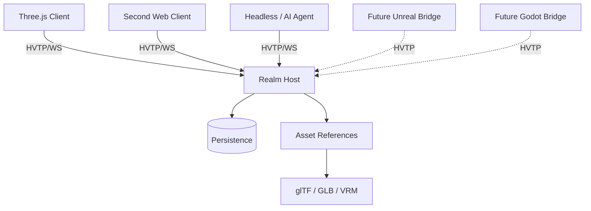

# 🛰️ Hyperverse Transfer Protocol (HVTP)

**HVTP** is an open application-layer protocol for **shared spatial worlds**.

It defines how heterogeneous clients, engines, simulations, services, and autonomous agents can agree on:

- what entities exist;
- what components and state those entities have;
- who is authoritative for mutable state;
- how participants observe and interact with the world;
- how portable assets are referenced;
- how world state is synchronized and persisted.

> **Designed to bridge virtual environments — not platforms.**

HVTP is not a game engine, rendering API, social platform, blockchain, or metaverse product. It is a protocol substrate that applications can build on.

---

## 🚧 Status

HVTP is currently an **experimental protocol redesign**.

The current working specification is:

- [HVTP 0.2 Draft Core Specification](./protocol-spec/hvtp.md)
- [HVTP 0.2 Prototype Profile P1](./protocol-spec/prototype-profile.md)
- [P1 Adversarial Conformance Cases](./protocol-spec/p1-conformance.md)

The immediate goal is not protocol completeness. It is to build the smallest credible interoperability experiment and learn from real implementation pressure.

---

## ✨ Core design

HVTP 0.2 moves away from treating a glTF scene graph as the entire shared world model.

Instead:

```text
HVTP Realm
└── Entity
    ├── Transform
    ├── Renderable ─────► glTF / GLB
    ├── Material
    ├── Physics
    ├── Interaction
    ├── Ownership
    ├── Permissions
    ├── Presence
    └── Behaviour
```

The distinction is deliberate:

> **glTF describes portable renderable content. HVTP describes world identity, state, authority, interaction, and change.**

A Three.js client, Unreal client, Godot client, headless simulation, or AI agent should all be able to observe the same HVTP entity without sharing the same engine object model.

---

## 🧭 Design principles

### Entity + component world model

World state is composed from engine-neutral entities and versioned components.

No core concept depends on `THREE.Object3D`, Unreal Actor, Unity GameObject, or Godot Node.

### Explicit authority

Ownership is not authority.

Every mutable component has a defined canonical writer or consistency model. Local prediction is allowed; canonical state is explicit.

This prevents "every client simulated it, hopefully they all agree" from becoming a distributed-systems strategy.

### First-class human and AI participants

Humans, bots, services, simulations, and AI agents use the same participant model.

A persistent external intelligence may project one or more spatial **presence entities** into a realm without moving its reasoning or memory into the avatar itself.

### Assets are references

glTF/GLB is the preferred portable 3D asset format. VRM may be used for avatars. Other media types can be negotiated.

Assets are content referenced by world state, not the world model itself.

### Capability-based behaviours

HVTP is intended to support portable behaviours through sandboxed runtimes such as WASM, Lua, or behaviour graphs.

Scripts do not receive ambient filesystem/network/process access. World mutations still pass through normal authority and permission rules.

### Transport profiles

The semantic protocol is transport independent.

The first reference profile intentionally uses **JSON over WebSocket**. WebTransport, binary encodings, and peer/federated transports are later profiles rather than prerequisites.

---

## 📦 Conceptual architecture



The renderer is deliberately replaceable.

```text
HVTP Entity
    │
    ├── Three.js Adapter ──► THREE.Object3D
    ├── Unreal Adapter ────► Actor / Components
    ├── Godot Adapter ─────► Node3D
    └── Agent Adapter ─────► structured observation/action
```

---

## 🧱 Core concepts

HVTP 0.2 distinguishes several concepts that are often accidentally collapsed:

| Concept | Meaning |
| --- | --- |
| **Realm** | Shared spatial state space |
| **Region** | Host/scaling partition inside a realm |
| **Participant** | Connected human, bot, AI, service, or simulation |
| **Principal** | Persistent identity reference |
| **Presence** | Spatial projection of a participant |
| **Entity** | Identity-bearing world object |
| **Component** | Typed state attached to an entity |
| **Authority** | Source allowed to publish canonical component state |
| **Permission** | Whether an actor may request an operation |
| **Ownership** | Application/domain metadata |
| **Event** | Something that happened |
| **Subscription** | State/event interest declaration |
| **Asset** | Referenced external content |

Keeping these concepts separate is a major part of the 0.2 redesign.

---

## 🤖 AI agents and digital presences

HVTP treats AI agents as ordinary first-class participants.

That means an agent can:

- join a realm;
- subscribe to nearby or task-relevant entities;
- receive structured world state directly;
- maintain a spatial avatar/presence;
- interact with objects using semantic events;
- request permitted world mutations;
- communicate with humans and other agents.

The agent itself remains external to the presence unless an application chooses otherwise.

This model supports persistent reasoning or orchestration systems that project a digital representation into a shared world while their memory, tools, objectives, and execution remain outside that world.

---

## 🌍 Application layers

HVTP intentionally keeps higher-level world semantics outside the core protocol.

Applications may define extensions for concepts such as:

- land and spatial claims;
- persistent construction;
- civic institutions and governance;
- economy and commerce;
- social systems;
- historical or audit state.

The intended layering is:

```text
Application / world
  domain systems and product semantics
                    │
          HVTP application extensions
                    │
HVTP
  entities · components · events · authority · presence
                    │
      glTF / VRM / behaviours / assets
                    │
        WebSocket / future transports
```

This keeps HVTP useful across unrelated products and domains.

---

## 🧪 First prototype

The first prototype is intentionally small:

- TypeScript reference host;
- browser client using Three.js;
- JSON over WebSocket;
- checked-in glTF conformance asset resolved from a host-advertised HTTP(S) asset base;
- host-authoritative canonical state;
- simple durable persistence;
- human and agent participants.

The happy path remains deliberately modest: two browsers create/mutate a renderable cube, the host restarts without losing durable state, and a headless agent observes and requests a permitted change.

That demonstration is **not enough by itself**. P1 also requires adversarial cases for concurrent revisions, snapshot boundaries, serialized subscription generations, exact spatial membership, transform composition, retry uncertainty, presence authorization, persistence failures, bounded resource behavior, malformed input, asset resolution, and lifecycle publication precedence.

P1 uses two gates: **Reference Implementation Complete** for the reference host/Three.js/headless stack, followed by **Interoperability Accepted** when a second independently implemented consumer proves the same wire, transform, and lifecycle meaning. Only the second gate freezes P1.

See [Prototype Profile P1](./protocol-spec/prototype-profile.md) and [P1 Conformance Cases](./protocol-spec/p1-conformance.md).

---

## 🧰 Reference implementation status

Implementation has started on the P1 reference stack.

The first five bounded slices currently provide:

- an npm/TypeScript workspace rooted at `/packages`;
- `@hvtp/protocol-types` with P1 constants, error codes, closed-shape request validation, request-ID correlation, malformed-JSON classification, duplicate decoded-key detection, `realm.join`, `SubscriptionSelector`, and shared entity/component state types;
- `@hvtp/reference-host` with a WebSocket/HTTP entry point, fatal UTF-8 decoding, P1 message-size enforcement, `session.hello → session.welcome` negotiation, advertised limits/asset base, and serving of the checked-in unit-cube fixture;
- the initial connection lifecycle through `CONNECTED → NEGOTIATED → JOINING → JOINED`;
- one host process realm epoch shared by joined sessions;
- validated join of the single P1 prototype realm;
- a host-created, participant-private, static presence entity;
- ordered initial snapshot emission with both selected durable shared entities and the owning participant's private presence;
- a SQLite-backed durable world store for shared entities, component revisions, permanent tombstones, current-epoch sequence assignment, and restart recovery;
- wire validation and transactional execution for `entity.create`, `component.set`, `component.patch`, and `entity.delete`;
- same-session request-ID admission, structural-content conflict detection, and cached terminal ACK/error or `subscription.applied` results;
- per-connection ordered streams for initial snapshots, canonical create/update/delete and interest enter/leave projection, and noninterleaved subscription replacement batches;
- `subscription.set` with serialized unique generations, exact canonical boundary capture, replacement leaves before enters, and cached retries that never replay historical transitions;
- explicit snapshot-to-live and buffered-to-live handoff, including deterministic snapshot/transition/publication barriers;
- tracked shared-entity views with own private presence counted toward join, replacement, and live-growth capacity; overflow rejects replacements without changing the old view or closes only affected live subscribers after a world commit;
- UTF-8 serialized payload accounting against `maxQueuedOutboundBytes` for snapshot/transition/catch-up batches, bounded pending state-changing admission, and cancellation of queued work on disconnect;
- deterministic pre-commit and post-commit failure seams, with SQLite transaction rollback before commit and reconnect snapshot recovery after a response failure;
- P1 spatial/explicit-selector filtering over recovered durable state;
- a fresh realm epoch/sequence domain on host restart while durable state/revisions/tombstones survive;
- unit and real WebSocket multi-client integration tests for restart recovery, mutation outcomes, visibility transitions, and delayed-publication ordering.

The store uses Node's built-in `node:sqlite`; Node 22.13+ exposes it without the former command-line flag, although Node 22 still labels the module experimental.

The coordinator tracks the selector, generation, and shared-entity membership at the tail of each connection's admitted stream. A replacement synchronously captures SQLite state and its `baseRealmSeq`, then appends the complete applied/leave/enter batch behind earlier canonical effects. Later mutations are projected against that queued generation and append after the batch. Captured entity records are delivery payloads, not another world store. SQLite remains canonical.

Join registers the subscriber at its captured `snapshotBaseSeq` before snapshot enqueue starts. Later relevant mutations append behind the snapshot, and the same stream prevents ordinary live output from overtaking catch-up. ACKs and cached terminal retry responses remain independent of subscriber delivery. The byte budget includes queued batches and the batch currently waiting behind a test barrier; bytes are released when messages enter the transport queue. This does **not** account for the socket's remaining buffered bytes.

This is **not yet a fully P1-conformant host**. General request-rate limiting, full socket outbound-queue enforcement beyond the coordinator's snapshot/transition/catch-up buffer, the Three.js browser client, a headless reference agent, and the remaining P1 conformance matrix are deferred. Host tests cover the Slice 5 lifecycle/resource cases in C07/C08/C21/C22/C24/C28/C30/C31/C36; client rejection of stale generations or invalid snapshot metadata and independent-consumer acceptance remain unverified.

The reviewed HVTP 0.2/P1 specification is now merged on `main`; implementation work continues separately in the reference implementation PR.

---

## 🔌 Planned protocol areas

The current design includes or anticipates:

- session negotiation;
- realm join/leave;
- snapshots and live deltas;
- entity lifecycle;
- component state and revisions;
- explicit authority;
- interest subscriptions;
- identity and presence;
- permissions;
- semantic interactions/events;
- persistent state;
- sandboxed behaviours;
- portable assets;
- avatars;
- AI participants;
- future realm transfer/federation.

Several areas remain intentionally unresolved and are listed in the draft specification.

---

## 📂 Repository direction

```text
/protocol-spec
  hvtp.md
  prototype-profile.md
  p1-conformance.md
  /fixtures
    unit-cube.gltf

/packages                 # future
  protocol-types
  reference-host
  three-client
  agent-client

/examples                 # future
/docs                     # future RFCs and design notes
```

---

## 🤝 Contributing

HVTP is early enough that implementation feedback is more valuable than speculative completeness.

Good contributions include:

- protocol review;
- focused RFCs;
- interoperable client experiments;
- transport experiments after P1;
- engine adapters;
- security/adversarial review;
- behaviour sandbox experiments.

Please keep application-specific semantics out of core unless they are broadly required for interoperable spatial systems.

---

## 🧭 License

[MIT License](./LICENSE).

---

## Credits

HVTP is inspired by collaborative virtual environments, open virtual-world systems, the Open Metaverse Interoperability Group, the Khronos ecosystem, and the long history of people trying to make virtual worlds interoperable instead of trapping them inside one platform.
