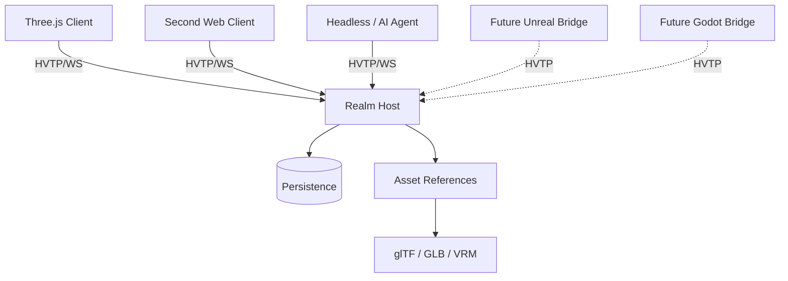

# 🛰️ Hyperverse Transfer Protocol (HVTP)

**HVTP** is an open application-layer protocol for **shared spatial worlds**.

It defines how heterogeneous clients, engines, simulations, services, and autonomous agents can agree on:

- what entities exist;
- what components and state those entities have;
- who is authoritative for mutable state;
- how participants observe and interact with the world;
- how portable assets are referenced;
- how world state is synchronized and persisted.

> **Designed to bridge virtual environments — not platforms.**

HVTP is not a game engine, rendering API, social platform, blockchain, or metaverse product. It is a protocol substrate that applications can build on.

---

## 🚧 Status

HVTP is currently an **experimental protocol redesign**.

The current working specification is:

- [HVTP 0.2 Draft Core Specification](./protocol-spec/hvtp.md)
- [HVTP 0.2 Prototype Profile P1](./protocol-spec/prototype-profile.md)
- [P1 Adversarial Conformance Cases](./protocol-spec/p1-conformance.md)

The immediate goal is not protocol completeness. It is to build the smallest credible interoperability experiment and learn from real implementation pressure.

### Project history and releases

HVTP keeps a deliberately small reporting system:

- [Technical changelog](./CHANGELOG.md) — developer/operator release history and the current unreleased technical delta.
- [Release notes](./RELEASE_NOTES.md) — client/user-facing changes suitable as the basis for shipped release notes.
- [Development journal](./docs/DEVELOPMENT_JOURNAL.md) — significant internal engineering context that should survive beyond individual PRs.
- [Contributor/agent guidance](./AGENTS.md) — when each history artifact must be updated and how progress/release reports should be reconstructed.

Pull requests and issues remain the granular evidence. GitHub Releases are reserved for real shipped version boundaries; **no GitHub Release has been published yet**.

---

## ✨ Core design

HVTP 0.2 moves away from treating a glTF scene graph as the entire shared world model.

Instead:

```text
HVTP Realm
└── Entity
    ├── Transform
    ├── Renderable ─────► glTF / GLB
    ├── Material
    ├── Physics
    ├── Interaction
    ├── Ownership
    ├── Permissions
    ├── Presence
    └── Behaviour
```

The distinction is deliberate:

> **glTF describes portable renderable content. HVTP describes world identity, state, authority, interaction, and change.**

A Three.js client, Unreal client, Godot client, headless simulation, or AI agent should all be able to observe the same HVTP entity without sharing the same engine object model.

---

## 🧭 Design principles

### Entity + component world model

World state is composed from engine-neutral entities and versioned components.

No core concept depends on `THREE.Object3D`, Unreal Actor, Unity GameObject, or Godot Node.

### Explicit authority

Ownership is not authority.

Every mutable component has a defined canonical writer or consistency model. Local prediction is allowed; canonical state is explicit.

This prevents "every client simulated it, hopefully they all agree" from becoming a distributed-systems strategy.

### First-class human and AI participants

Humans, bots, services, simulations, and AI agents use the same participant model.

A persistent external intelligence may project one or more spatial **presence entities** into a realm without moving its reasoning or memory into the avatar itself.

### Assets are references

glTF/GLB is the preferred portable 3D asset format. VRM may be used for avatars. Other media types can be negotiated.

Assets are content referenced by world state, not the world model itself.

### Capability-based behaviours

HVTP is intended to support portable behaviours through sandboxed runtimes such as WASM, Lua, or behaviour graphs.

Scripts do not receive ambient filesystem/network/process access. World mutations still pass through normal authority and permission rules.

### Transport profiles

The semantic protocol is transport independent.

The first reference profile intentionally uses **JSON over WebSocket**. WebTransport, binary encodings, and peer/federated transports are later profiles rather than prerequisites.

---

## 📦 Conceptual architecture



The renderer is deliberately replaceable.

```text
HVTP Entity
    │
    ├── Three.js Adapter ──► THREE.Object3D
    ├── Unreal Adapter ────► Actor / Components
    ├── Godot Adapter ─────► Node3D
    └── Agent Adapter ─────► structured observation/action
```

---

## 🧱 Core concepts

HVTP 0.2 distinguishes several concepts that are often accidentally collapsed:

| Concept | Meaning |
| --- | --- |
| **Realm** | Shared spatial state space |
| **Region** | Host/scaling partition inside a realm |
| **Participant** | Connected human, bot, AI, service, or simulation |
| **Principal** | Persistent identity reference |
| **Presence** | Spatial projection of a participant |
| **Entity** | Identity-bearing world object |
| **Component** | Typed state attached to an entity |
| **Authority** | Source allowed to publish canonical component state |
| **Permission** | Whether an actor may request an operation |
| **Ownership** | Application/domain metadata |
| **Event** | Something that happened |
| **Subscription** | State/event interest declaration |
| **Asset** | Referenced external content |

Keeping these concepts separate is a major part of the 0.2 redesign.

---

## 🤖 AI agents and digital presences

HVTP treats AI agents as ordinary first-class participants.

That means an agent can:

- join a realm;
- subscribe to nearby or task-relevant entities;
- receive structured world state directly;
- maintain a spatial avatar/presence;
- interact with objects using semantic events;
- request permitted world mutations;
- communicate with humans and other agents.

The agent itself remains external to the presence unless an application chooses otherwise.

This model supports persistent reasoning or orchestration systems that project a digital representation into a shared world while their memory, tools, objectives, and execution remain outside that world.

---

## 🌍 Application layers

HVTP intentionally keeps higher-level world semantics outside the core protocol.

Applications may define extensions for concepts such as:

- land and spatial claims;
- persistent construction;
- civic institutions and governance;
- economy and commerce;
- social systems;
- historical or audit state.

The intended layering is:

```text
Application / world
  domain systems and product semantics
                    │
          HVTP application extensions
                    │
HVTP
  entities · components · events · authority · presence
                    │
      glTF / VRM / behaviours / assets
                    │
        WebSocket / future transports
```

This keeps HVTP useful across unrelated products and domains.

---

## 🧪 First prototype

The first prototype is intentionally small:

- TypeScript reference host;
- browser client using Three.js;
- JSON over WebSocket;
- checked-in glTF conformance asset resolved from a host-advertised HTTP(S) asset base;
- host-authoritative canonical state;
- simple durable persistence;
- human and agent participants.

The happy path remains deliberately modest: two browsers create/mutate a renderable cube, the host restarts without losing durable state, and a headless agent observes and requests a permitted change.

That demonstration is **not enough by itself**. P1 also requires adversarial cases for concurrent revisions, snapshot boundaries, serialized subscription generations, exact spatial membership, transform composition, retry uncertainty, presence authorization, persistence failures, bounded resource behavior, malformed input, asset resolution, and lifecycle publication precedence.

P1 uses two gates: **Reference Implementation Complete** for the reference host/Three.js/headless stack, followed by **Interoperability Accepted** when a second independently implemented consumer proves the same wire, transform, and lifecycle meaning. Only the second gate freezes P1.

See [Prototype Profile P1](./protocol-spec/prototype-profile.md) and [P1 Conformance Cases](./protocol-spec/p1-conformance.md).

---

## 🧰 Reference implementation status

Implementation has started on the P1 reference stack.

The first six bounded slices provide the reference host:

- an npm/TypeScript workspace rooted at `/packages`;
- `@hvtp/protocol-types` with P1 constants, error codes, closed-shape request validation, request-ID correlation, malformed-JSON classification, duplicate decoded-key detection, `realm.join`, `SubscriptionSelector`, and shared entity/component state types;
- `@hvtp/reference-host` with a WebSocket/HTTP entry point, fatal UTF-8 decoding, P1 message-size enforcement, `session.hello → session.welcome` negotiation, advertised limits/asset base, and serving of the checked-in unit-cube fixture;
- the initial connection lifecycle through `CONNECTED → NEGOTIATED → JOINING → JOINED`;
- one host process realm epoch shared by joined sessions;
- validated join of the single P1 prototype realm;
- a host-created, participant-private, static presence entity;
- ordered initial snapshot emission with both selected durable shared entities and the owning participant's private presence;
- a SQLite-backed durable world store for shared entities, component revisions, permanent tombstones, current-epoch sequence assignment, and restart recovery;
- wire validation and transactional execution for `entity.create`, `component.set`, `component.patch`, and `entity.delete`;
- same-session request-ID admission, structural-content conflict detection, and cached terminal ACK/error or `subscription.applied` results;
- per-connection ordered streams for initial snapshots, canonical create/update/delete and interest enter/leave projection, and noninterleaved subscription replacement batches;
- `subscription.set` with serialized unique generations, exact canonical boundary capture, replacement leaves before enters, and cached retries that never replay historical transitions;
- explicit snapshot-to-live and buffered-to-live handoff, including deterministic snapshot/transition/publication barriers;
- tracked shared-entity views with own private presence counted toward join, replacement, and live-growth capacity; overflow rejects replacements without changing the old view or closes only affected live subscribers after a world commit;
- UTF-8 serialized payload accounting against `maxQueuedOutboundBytes` for snapshot/transition/catch-up batches, bounded pending state-changing admission, and cancellation of queued work on disconnect;
- deterministic pre-commit and post-commit failure seams, with SQLite transaction rollback before commit and reconnect snapshot recovery after a response failure;
- P1 spatial/explicit-selector filtering over recovered durable state;
- a fresh realm epoch/sequence domain on host restart while durable state/revisions/tombstones survive;
- per-connection sliding-window request limiting: `maxClientRequestsPerSecond` (every physical request, including malformed ones) and `maxMutationRequestsPerSecond` (new durable mutations only), driven by an injectable monotonic clock;
- one per-connection outbound byte budget (`maxQueuedOutboundBytes`) shared by coordinator batches, direct control responses, and writes the WebSocket has not yet completed, with exactly-once release and cleanup on close or send failure;
- real-wire coverage of single-frame and fragmented `maxMessageBytes` enforcement, `1007` on invalid UTF-8, multibyte characters split across fragments, and C33 JSON/request-shape classification;
- safe-integer realm-sequence and component-revision overflow rejection before mutation, and live-entity-plus-tombstone budget exhaustion (`maxPersistentEntityRecords`);
- asset-serving checks (media type, 404, 413 above `maxAssetBytes`) and a startup check that rejects plain-HTTP asset origins outside loopback/local development;
- unit and real WebSocket multi-client integration tests for restart recovery, mutation outcomes, visibility transitions, and delayed-publication ordering.

The store uses Node's built-in `node:sqlite`; Node 22.13+ exposes it without the former command-line flag, although Node 22 still labels the module experimental.

The coordinator tracks the selector, generation, and shared-entity membership at the tail of each connection's admitted stream. A replacement synchronously captures SQLite state and its `baseRealmSeq`, then appends the complete applied/leave/enter batch behind earlier canonical effects. Later mutations are projected against that queued generation and append after the batch. Captured entity records are delivery payloads, not another world store. SQLite remains canonical.

Join registers the subscriber at its captured `snapshotBaseSeq` before snapshot enqueue starts. Later relevant mutations append behind the snapshot, and the same stream prevents ordinary live output from overtaking catch-up. ACKs and cached terminal retry responses remain independent of subscriber delivery. One per-connection byte budget covers coordinator-held batches, direct responses, and WebSocket sends until their write callbacks complete. Coordinator reservations transfer to the transport without being counted twice, and close/failure releases outstanding accounting exactly once.

A host-side delivery detail was added in Slice 7: the public, credential-free fixture response carries `Access-Control-Allow-Origin: *` so a browser client served from another origin (such as a dev server) can read it. This is not protocol semantics.

### Slice 7: engine-neutral client core and Three.js browser reference client

Two new packages consume the host strictly over the P1 wire:

| Package | Role | Depends on Three.js? |
| --- | --- | --- |
| `@hvtp/client-core` | P1 session lifecycle, wire validation, atomic snapshots, canonical entity view, subscription generations, request correlation, reconnect uncertainty | **No.** Runs in browsers and Node; reusable by the future headless agent |
| `@hvtp/three-client` | Three.js adapter (`P1ThreeView`), fixture loader, placeholder, runnable browser demo | Yes, behind the adapter only |

No `THREE.*` type appears in protocol messages, canonical entity state, or `client-core` state. The renderer receives a read-only view source (`on`, `assetBaseUri`, `limits`) with no request methods, so a presentation failure cannot become a shared mutation.

**Session lifecycle.** `P1Client` moves through `disconnected → connecting → negotiating → joining → snapshot → live`. It sends `session.hello` (participant kind `human` by default, `agent` for headless use), validates `session.welcome` (HVTP 0.2, participant ID, absolute HTTP(S) `assetBaseUri` ending in `/`, limits), sends `realm.join`, and becomes `live` only after a valid initial snapshot has been activated. Sockets come from an injectable factory implementing the minimal WHATWG `WebSocket` surface. Browsers use the native `WebSocket`; tests use `ws` or an in-memory fake.

**Wire validation.** Every host frame is parsed with duplicate-key detection and checked against the closed P1 shape and numeric domains: normalized quaternions, scale/position ranges, linear `[0,1]` RGBA, and the exact fixture renderable. Host-generated IDs are opaque (Profile §14.0): any non-empty ID is accepted, because the 128-byte limit applies to client-generated IDs only. Only the participant's own presence is accepted. Any violation discards session state and closes with code `4002`. The client never repairs host output.

**Snapshot atomicity (C30).** `realm.joined`, `realm.snapshot.begin`, every `entity.snapshot`, and `realm.snapshot.end` must agree on realm, `realmEpoch`, `snapshotId`, and `snapshotBaseSeq`, plus `subscriptionId` at begin/end. `entityCount` must equal the number of records, entity IDs must be unique, and the participant's own presence must be present. Records collect in a private map, and only a fully consistent `realm.snapshot.end` replaces the active view in one step. A mismatch, an incomplete snapshot, or a live publication arriving before `end` discards the snapshot and closes the connection. No entity is ever partially activated.

**Canonical view.** The active view is a `Map<EntityId, P1Entity>` of deep-frozen host records. `entity.created` and `view.entity.enter` materialize complete entities from the message alone; a re-enter replaces any earlier record. `component.updated` replaces the full component envelope, and its revision must advance. `view.entity.leave` evicts without a tombstone. `entity.deleted` removes the entity. Sending `component.patch`/`component.set` never changes the view optimistically: the view changes only through subscriber publications or a fresh snapshot. Realm-scoped messages from a different `realmEpoch` are treated as a protocol violation. `seq` is never used for gap detection or deduplication.

**Subscription generations (C28).** Subscriber-scoped messages apply only when `body.subscriptionId` equals the active generation; others are ignored and reported as `publication.stale`. A `subscription.applied` activates its generation only when it answers a pending `subscription.set` and its `previousSubscriptionId` equals the active generation. A cached/older response to a pending request still resolves it, with `activated: false`, but never reactivates an old view. A response that answers no pending request (for example a duplicate terminal response) is ignored without changing state; one that answers a different kind of request is a protocol violation.

**Requests and uncertainty (C12, C13).** `createEntity`, `deleteEntity`, `setComponent`, `patchComponent`, and `setSubscription` send real P1 requests with collision-resistant IDs. They resolve only from terminal `ack` / `subscription.applied` and reject with `P1RequestError` on `error`, independently of subscriber delivery. If the socket closes first, the request rejects with `P1OutcomeUncertainError`. The client invalidates participant, presence, epoch, generation, partial snapshot, and the active view (an empty `view.reset`), and never replays the request ID. After `connect()` takes a fresh snapshot, the caller decides whether a new request, with a new ID and current revision, is still needed.

**Three.js hierarchy and transform (C17).** Each renderable entity is an `Object3D` that carries the HVTP transform. Its child is a clone of the glTF node `UnitCube`, so the node hierarchy is evaluated first and `T × R × S` wraps it. Position, quaternion `[x, y, z, w]`, and scale are copied component-wise, with no Euler conversion. Both conventions are right-handed, +Y up, in metres. The C17 test runs the real adapter and loaded fixture node: local `[0.5,0.5,0.5]` with scale `[2,1,1]` and +90° about +Z maps to `[-0.5, 1, 0.5]` within `1e-6`.

**Material (C18) and visibility.** `baseColor` is written into per-entity cloned materials as linear RGB factors (`LinearSRGBColorSpace`, no sRGB/UI conversion). Alpha sets `opacity`/`transparent`. The renderer's output color space handles display encoding only. `visible: false` hides the entity's object but keeps it in canonical state and view membership. Own presence is kept in client state but not rendered.

**Asset policy (C34).** The fixture URI is resolved against the session's advertised `assetBaseUri` with normal URL resolution. The client fetches it with `redirect: "manual"` and `credentials: "omit"`, requires HTTP 200 and media type `model/gltf+json`, and rejects a `Content-Length` above `maxAssetBytes`. It also counts streamed bytes and cancels the body as soon as the limit would be exceeded. Bytes are parsed with `GLTFLoader.parse`, never `GLTFLoader.load(url)`. Embedded glTF resources must be `data:` URIs, so parsing cannot trigger further fetches. The validated template is cached per session. Each entity gets a clone with its own materials, and the shared, cache-owned geometry is never disposed while in use.

**Placeholder.** A redirect, non-200 response, oversized body, network failure, wrong media type, invalid glTF, missing `UnitCube` node, or external resource reference yields a magenta wireframe octahedron. It is local-only, generic, and needs no further network access. Shared state is never mutated and no request is sent. Placeholders still follow canonical transform and visibility.

**Removal.** Leave, delete, snapshot replacement, and disconnect remove the entity's object and dispose its per-entity materials or placeholder resources. Leave/re-enter cycles rebuild from the new complete record and do not accumulate objects.

#### Running the browser demo

```bash
npm install
npm run build
HVTP_DB_PATH=./data/p1.sqlite PORT=8787 npm run host   # terminal 1: ws://127.0.0.1:8787/hvtp
npm run client:dev                                     # terminal 2: http://127.0.0.1:5173/
```

The demo's host URL field defaults to `ws://127.0.0.1:8787/hvtp`; override it in the field or with `?host=ws://…/hvtp`. `npm run build` also emits a static bundle to `packages/three-client/dist/web/` (`npm run preview --workspace @hvtp/three-client`). Demo buttons only send HVTP requests: create cube, move +X (`component.patch`), random color (`component.set`), delete, and apply a spatial subscription. The scene changes only when canonical publications arrive.

Manual acceptance procedure (supplements the automated tests):

1. start the reference host;
2. start the browser dev server;
3. open two browser windows (A and B) on the demo;
4. connect both; each reports `phase: live`;
5. create a cube in A;
6. verify B displays the glTF fixture (entity list shows `[loaded]`);
7. select it in A and press **Move +X**; B's cube moves;
8. press **Random color** in B; A's cube changes color;
9. stop and restart the host on the same database; both windows show `disconnected` with an empty scene;
10. press **Connect** in both;
11. verify the cube returns with the last transform/material revisions (`t#`/`m#` in the entity list) under a new `realmEpoch`.

This procedure was performed against the Slice 7 build in a Chromium-based browser. Browser automation (Playwright or similar) is deliberately deferred so the repository does not take on a browser-testing framework. Deterministic client-core tests, Three scene-graph tests, and real-host integration tests carry the evidence.

#### Slice 7 tests

- `client-core` (fake socket): negotiation, atomic snapshot activation, rejection of mismatched `snapshotId`/`snapshotBaseSeq`/`realmEpoch`/`subscriptionId`/`entityCount`/duplicate IDs/foreign presence, partial-snapshot discard, live publications during a snapshot, the full publication lifecycle, invariant violations, sparse and equal `seq`, stale generations and cached `subscription.applied`, terminal handling independent of view membership, disconnect uncertainty without replay, and frozen canonical records.
- `client-core` against the real reference host: a two-client create/move/recolor/delete happy path; a requester whose own move evicts the entity still resolving from its ACK; serialized replacements on a live connection; and a file-backed restart with a lost-reply seam. That restart test shows an uncertain write that did commit, is revealed only by the fresh snapshot in the new epoch, and is never replayed.
- `three-client` (Node, no WebGL): the C17 numeric assertion through the loaded fixture node, transform mapping, linear base color/alpha, frozen-state reads, per-entity material isolation, visibility, presence not rendered, lifecycle add/update/leave/re-enter/delete, leak-free leave/re-enter cycles, disconnect/reconnect rebuild, asset URL resolution/policy, and a ten-case asset-failure matrix. Every failure case asserts the placeholder, one fetch attempt, no request sent, and unchanged canonical state.

Node lacks the browser `ProgressEvent` global that `GLTFLoader`'s `FileLoader` uses when decoding the embedded `data:` buffer. The adapter tests install a test-only shim for it.

#### Status and deferred work

This is **not yet a fully P1-conformant implementation** and does not claim P1 conformance. Host tests cover the host-side lifecycle/resource cases in C07/C08/C21/C22/C24/C28/C30/C31/C32/C33/C36 plus the host-applicable parts of C34. Slice 7 adds client-side evidence for C12, C13, C17, C18, C28 stale-generation and cached-response rejection, C30 snapshot-metadata rejection, C34 renderer-local asset behavior, and happy-path steps 1–12.

Still deferred:

- the headless P1 reference agent and happy-path steps 13–16;
- the full host/browser/agent conformance sweep and any gap closure it finds;
- automated browser smoke tests;
- an independently implemented second consumer and the C23/C37 interoperability gate. The Three.js client is not that consumer, and sharing `client-core` with the future headless agent does not satisfy it either.

The reviewed HVTP 0.2/P1 specification is now merged on `main`; implementation work continues separately in the reference implementation PR.

---

## 🔌 Planned protocol areas

The current design includes or anticipates:

- session negotiation;
- realm join/leave;
- snapshots and live deltas;
- entity lifecycle;
- component state and revisions;
- explicit authority;
- interest subscriptions;
- identity and presence;
- permissions;
- semantic interactions/events;
- persistent state;
- sandboxed behaviours;
- portable assets;
- avatars;
- AI participants;
- future realm transfer/federation.

Several areas remain intentionally unresolved and are listed in the draft specification.

---

## 📂 Repository direction

```text
/protocol-spec
  hvtp.md
  prototype-profile.md
  p1-conformance.md
  /fixtures
    unit-cube.gltf

/packages
  protocol-types
  reference-host
  client-core
  three-client
  agent-client             # future

/examples                 # future
/docs                     # future RFCs and design notes
```

---

## 🤝 Contributing

HVTP is early enough that implementation feedback is more valuable than speculative completeness.

Good contributions include:

- protocol review;
- focused RFCs;
- interoperable client experiments;
- transport experiments after P1;
- engine adapters;
- security/adversarial review;
- behaviour sandbox experiments.

Please keep application-specific semantics out of core unless they are broadly required for interoperable spatial systems.

---

## 🧭 License

[MIT License](./LICENSE).

---

## Credits

HVTP is inspired by collaborative virtual environments, open virtual-world systems, the Open Metaverse Interoperability Group, the Khronos ecosystem, and the long history of people trying to make virtual worlds interoperable instead of trapping them inside one platform.
