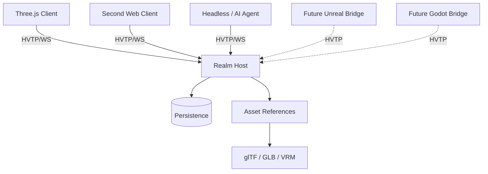

# 🛰️ Hyperverse Transfer Protocol (HVTP)

**HVTP** is an open application-layer protocol for **shared spatial worlds**.

It defines how heterogeneous clients, engines, simulations, services, and autonomous agents can agree on:

- what entities exist;
- what components and state those entities have;
- who is authoritative for mutable state;
- how participants observe and interact with the world;
- how portable assets are referenced;
- how world state is synchronized and persisted.

> **Designed to bridge virtual environments — not platforms.**

HVTP is not a game engine, rendering API, social platform, blockchain, or metaverse product. It is a protocol substrate that applications can build on.

---

## 🚧 Status

HVTP is currently an **experimental protocol redesign**.

The current working specification is:

- [HVTP 0.2 Draft Core Specification](./protocol-spec/hvtp.md)
- [HVTP 0.2 Prototype Profile P1](./protocol-spec/prototype-profile.md)

The immediate goal is not protocol completeness. It is to build the smallest credible interoperability experiment and learn from real implementation pressure.

---

## ✨ Core design

HVTP 0.2 moves away from treating a glTF scene graph as the entire shared world model.

Instead:

```text
HVTP Realm
└── Entity
    ├── Transform
    ├── Renderable ─────► glTF / GLB
    ├── Material
    ├── Physics
    ├── Interaction
    ├── Ownership
    ├── Permissions
    ├── Presence
    └── Behaviour
```

The distinction is deliberate:

> **glTF describes portable renderable content. HVTP describes world identity, state, authority, interaction, and change.**

A Three.js client, Unreal client, Godot client, headless simulation, or AI agent should all be able to observe the same HVTP entity without sharing the same engine object model.

---

## 🧭 Design principles

### Entity + component world model

World state is composed from engine-neutral entities and versioned components.

No core concept depends on `THREE.Object3D`, Unreal Actor, Unity GameObject, or Godot Node.

### Explicit authority

Ownership is not authority.

Every mutable component has a defined canonical writer or consistency model. Local prediction is allowed; canonical state is explicit.

This prevents "every client simulated it, hopefully they all agree" from becoming a distributed-systems strategy.

### First-class human and AI participants

Humans, bots, services, simulations, and AI agents use the same participant model.

A persistent external intelligence may project one or more spatial **presence entities** into a realm without moving its reasoning or memory into the avatar itself.

### Assets are references

glTF/GLB is the preferred portable 3D asset format. VRM may be used for avatars. Other media types can be negotiated.

Assets are content referenced by world state, not the world model itself.

### Capability-based behaviours

HVTP is intended to support portable behaviours through sandboxed runtimes such as WASM, Lua, or behaviour graphs.

Scripts do not receive ambient filesystem/network/process access. World mutations still pass through normal authority and permission rules.

### Transport profiles

The semantic protocol is transport independent.

The first reference profile intentionally uses **JSON over WebSocket**. WebTransport, binary encodings, and peer/federated transports are later profiles rather than prerequisites.

---

## 📦 Conceptual architecture



The renderer is deliberately replaceable.

```text
HVTP Entity
    │
    ├── Three.js Adapter ──► THREE.Object3D
    ├── Unreal Adapter ────► Actor / Components
    ├── Godot Adapter ─────► Node3D
    └── Agent Adapter ─────► structured observation/action
```

---

## 🧱 Core concepts

HVTP 0.2 distinguishes several concepts that are often accidentally collapsed:

| Concept | Meaning |
| --- | --- |
| **Realm** | Shared spatial state space |
| **Region** | Host/scaling partition inside a realm |
| **Participant** | Connected human, bot, AI, service, or simulation |
| **Principal** | Persistent identity reference |
| **Presence** | Spatial projection of a participant |
| **Entity** | Identity-bearing world object |
| **Component** | Typed state attached to an entity |
| **Authority** | Source allowed to publish canonical component state |
| **Permission** | Whether an actor may request an operation |
| **Ownership** | Application/domain metadata |
| **Event** | Something that happened |
| **Subscription** | State/event interest declaration |
| **Asset** | Referenced external content |

Keeping these concepts separate is a major part of the 0.2 redesign.

---

## 🤖 AI agents and digital presences

HVTP treats AI agents as ordinary first-class participants.

That means an agent can:

- join a realm;
- subscribe to nearby or task-relevant entities;
- receive structured world state directly;
- maintain a spatial avatar/presence;
- interact with objects using semantic events;
- request permitted world mutations;
- communicate with humans and other agents.

The agent itself remains external to the presence unless an application chooses otherwise.

This model supports persistent reasoning or orchestration systems that project a digital representation into a shared world while their memory, tools, objectives, and execution remain outside that world.

---

## 🌍 Application layers

HVTP intentionally keeps higher-level world semantics outside the core protocol.

Applications may define extensions for concepts such as:

- land and spatial claims;
- persistent construction;
- civic institutions and governance;
- economy and commerce;
- social systems;
- historical or audit state.

The intended layering is:

```text
Application / world
  domain systems and product semantics
                    │
          HVTP application extensions
                    │
HVTP
  entities · components · events · authority · presence
                    │
      glTF / VRM / behaviours / assets
                    │
        WebSocket / future transports
```

This keeps HVTP useful across unrelated products and domains.

---

## 🧪 First prototype

The first prototype is intentionally small:

- TypeScript reference host;
- browser client using Three.js;
- JSON over WebSocket;
- glTF/GLB assets over HTTP(S);
- simple durable persistence;
- human and agent participants.

The acceptance test is:

1. two browser clients join one realm;
2. client A creates a cube;
3. client B sees it;
4. A moves it and B sees the canonical transform;
5. B changes its material and A sees the result;
6. the host restarts and the cube persists;
7. a headless agent joins, observes the entity, and performs a permitted mutation;
8. both human clients observe the agent's accepted change.

After that passes, the next major proof should be a **second independently implemented client/runtime**, not feature expansion.

See [Prototype Profile P1](./protocol-spec/prototype-profile.md).

---

## 🔌 Planned protocol areas

The current design includes or anticipates:

- session negotiation;
- realm join/leave;
- snapshots and live deltas;
- entity lifecycle;
- component state and revisions;
- explicit authority;
- interest subscriptions;
- identity and presence;
- permissions;
- semantic interactions/events;
- persistent state;
- sandboxed behaviours;
- portable assets;
- avatars;
- AI participants;
- future realm transfer/federation.

Several areas remain intentionally unresolved and are listed in the draft specification.

---

## 📂 Repository direction

```text
/protocol-spec
  hvtp.md
  prototype-profile.md

/packages                 # future
  protocol-types
  reference-host
  three-client
  agent-client

/examples                 # future
/docs                     # future RFCs and design notes
```

---

## 🤝 Contributing

HVTP is early enough that implementation feedback is more valuable than speculative completeness.

Good contributions include:

- protocol review;
- focused RFCs;
- interoperable client experiments;
- transport experiments after P1;
- engine adapters;
- security/adversarial review;
- behaviour sandbox experiments.

Please keep application-specific semantics out of core unless they are broadly required for interoperable spatial systems.

---

## 🧭 License

[MIT License](./LICENSE).

---

## Credits

HVTP is inspired by collaborative virtual environments, open virtual-world systems, the Open Metaverse Interoperability Group, the Khronos ecosystem, and the long history of people trying to make virtual worlds interoperable instead of trapping them inside one platform.
